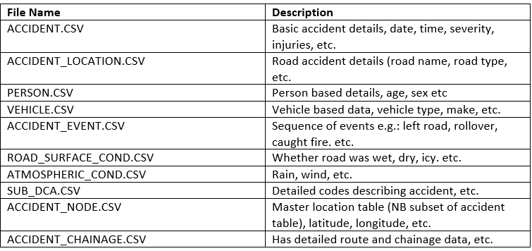
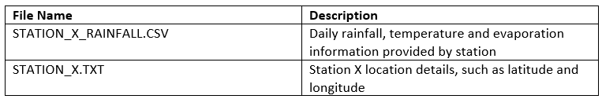

<center>

</center>

## Background
Towards zero is the 2016-2020 road safety strategy for the state of Victoria. The strategy is a collaboration between multiple Victorian government bodies including the Transport Accident Commission, VicRoads, Victorian Police, the Department of Justice and Regulation and the Department of Health and Human Services to achieve zero road deaths in Victoria.

The short term objective of the collaboration is to reduce annual road fatalities to below 200 by 2020 and reduce serious injuries, which require hospital admission, by 15% over the 5 year period between 2016-2020.

The Towards Zero campaign in centered upon the mantra of safer roads, safer speeds, safer vehicles and safer road users through improving infrastructure, focused education campaigns, increased monitoring and implementing innovations.

<center>

</center>


Since the implementation of the Towards Zero strategy, progress has been made to reduce both road fatalities and serious injuries. However, to ensure total deaths are below 200 by 2020, resourcing and policy needs to be implemented efficiently, which this investigation aims to inform.

### Weather Conditions as a Factor of Road Safety
Inclement weather conditions are widely regarded as a contributing factor to increased risk of road accidents. Conditions such as precipitation, high winds and temperatrue extremes may affect driver capabilities, traffic flow and  vehicle performance via traction, stability and manoeuvrability (Baguley 2001; Goodwin 2002).

The relationship between weather and road accidents has been widely analysed in recent years with studies performed in multiple countries including Belgium, France, Denmark and Finland (Karlaftis & Yannis 2010).

To accomodate changes in weather, governing authorities have provided adverse condition warnings (https://roadsafety.transport.nsw.gov.au/stayingsafe/drivers/badweather/index.html) and implemented road laws such as variable speed limits to influence driver behavious.

## Proposed Research Questions
To further investigate the reasons of high injury severity crashes and the effect of weather conditions on Victorian road accidents, the following research questions are being proposed:   
1. What effect, if any, does weather has on the severity of road accidents?   
2. Assuming wet conditions, how do driver age, vehicle quality and road condition impact accident severity?   
3. How do seat belts and helmets impact on injury level?   
4. What changes, if any, do our findings recommend to the Towards Zero campaign?   

## Data Sets
Of the plethora of data sets investigated, a select few remain which satisfied the criteria of  a credible source, sufficient number of records, granularity at an individual level and relevant variables to address the proposed questions. The data sets identified are:

**Road Accident Dataset**

<center>



Provided by VicRoads, the state road and traffic authority, the road accident data set details up to 130 variables for over 180 thousand accidents occurring between 2006 and 2019 in Victoria, Australia.
</center>
**Weather Datasets**
<center>


The weather data set is sourced from the Bureau of Meteorology, providing comprehensive daily statistics pertaining to weather conditions across stations in Victoria.
</center>
### Data Merging
To address the research questions proposed, the data sets need to be merged on dimensions of time and location. With regards to time, both road crashes and weather datasets are documented on a day-basis and thus can be merged using the date variable. Merging on location is more difficult, as it will be necessary to calculate the distance between accidents and climate observatory stations, using latitude and longitude information, and then use the climate data from the closest observatory station in order to achieve a better quality in the analysis.

## Regression Modelling
The Ordinal Logistic Regression Model can be used to predict the behavior of an ordinal dependent variable given one or more independent variables. During this research, this model will be used in order to predict an accident severity level given the driver age, vehicle quality and road condition, answering the following research question "Assuming wet conditions, how do driver age, vehicle quality and road condition impact accident severity?". 


## Issues
Throughout the project, the following have been identified as potential issues to consider and address:

* Accurately assigning weather conditions to each road accident
* Multicollinearity between weather conditions
* Accounting for potentially missing explanatory variables
* Complexity of capturing and measuring weather variables

## Appendix
#### Reading Libraries
``` {r, results='hide', message=FALSE, warning=FALSE}
library(tidyverse)
library(geosphere) #to calculate geographical distances
```

#### Reading Data
``` {r, results='hide', message=FALSE, warning=FALSE}
accident <- read.csv("Datasets/Road Crashes/ACCIDENT.csv")
climate86018 <- read.csv("Datasets/Climate/86018.csv")
accident_node <-  read.csv("Datasets/Road Crashes/NODE.CSV")
```

#### Data Transformation
```{r}
glimpse(accident)
glimpse(climate86018)

#Adding station latitude and longitude to all rows (to calculate distance between the accident and climate station)
climate86018$station_lat <- rep(-37.8795,nrow(climate86018))
climate86018$station_long <- rep(145.0368,nrow(climate86018))

#Converting fct to date
accident$ACCIDENTDATE <- as.Date(accident$ACCIDENTDATE, "%d/%m/%Y")
climate86018$YYYY.MM.DD  <- as.Date (climate86018$YYYY.MM.DD, "%Y-%m-%d")

#Rename date columns (to be used as primary key between accidents and climate data)
accident <- accident %>% rename (DATE = ACCIDENTDATE)
climate86018 <- climate86018 %>% rename (DATE = YYYY.MM.DD)
```

#### Merging Data
```{r}
#Creating mergedFiles object, which contains accident, accident location and climate data
mergedFiles <- merge(accident,accident_node,by="ACCIDENT_NO")
mergedFiles <- merge(mergedFiles, climate86018,by="DATE")
```

#### Calculating Distance
```{r}
#Adding dist_station_crash column with distance between accident location and climate observatory
mergedFiles <- mergedFiles %>% 
	mutate(dist_station_crash = distHaversine(cbind(station_long, station_lat), cbind(Long, Lat)))

glimpse(mergedFiles)
```

## References
Bergel-Hayat, R., Debbarh, M., Antoniou, C. and Yannis, G. (2013). Explaining the road accident risk: Weather effects. Accident Analysis & Prevention, 60, pp.456-465.

Al Hassan, Y. and Barker, D. (1999). The impact of unseasonable or extreme weather on traffic activity within Lothian region, Scotland. Journal of Transport Geography, 7(3), pp.209-213.

Ops.fhwa.dot.gov. (2019). How Do Weather Events Impact Roads? - FHWA Road Weather Management. [online] Available at: https://ops.fhwa.dot.gov/weather/q1_roadimpact.htm [Accessed 1 Sep. 2019].

Baguley, C. (2019). The importance of a road accident data system and its utilisation.. [online] Pdfs.semanticscholar.org. Available at: https://pdfs.semanticscholar.org/2d8e/c35ac2bd46cc41934d84e1ee2024da6dbec1.pdf [Accessed 1 Sep. 2019].

Goodwin, L. (2019). Weather Impacts on Arterial Traffic Flow. [online] Citeseerx.ist.psu.edu. Available at: https://citeseerx.ist.psu.edu/viewdoc/download?doi=10.1.1.587.9563&rep=rep1&type=pdf [Accessed 1 Sep. 2019].

