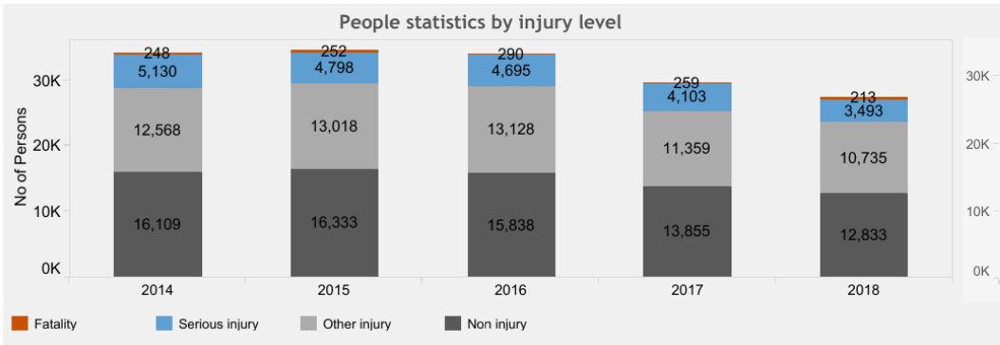

## Background
Towards zero is the 2016-2020 road safety strategy for the state of Victoria. The strategy is a collaboration between multiple Victorian government bodies including the Transport Accident Commission, VicRoads, Victorian Police, the Department of Justice and Regulation and the Department of Health and Human Services to achieve zero road deaths in Victoria.

The short term objective of the collaboration is to reduce annual road fatalities to below 200 by 2020 and reduce serious injuries, which require hospital admission, by 15% over the 5 year period between 2016-2020.

The Towards Zero campaign in centered upon the mantra of safer roads, safer speeds, safer vehicles and safer road users through improving infrastructure, focused education campaigns, increased monitoring and implementing innovations.

The purpose of this report is to provide an overview of Victoria’s road fatalities and serious injuries, 

Weather acts through visibility impairments, precipitation, high winds, and temperature extremes to affect driver capabilities, vehicle performance (i.e., traction, stability and maneuverability), pavement friction, roadway infrastructure, crash risk, traffic flow, and agency productivity. Our focus here is to analyse the importance of initiating a good road accident database and analysis system. Road accidents are not always published by all parts of the world except for the ones that are severely injured or involving mortality. Based on a detailed analysis, the WHO made predictions of the situation for the year 2020, Road accidents are predicted to rise to third place (after ischaemic heart disease and unipolar major depression). Thus the need to attempt to prevent road accidents by whatever means are effective will become increasingly important. (ChrisBaguley, 2001) 

On average, nearly 5,000 people are killed and over 418,000 people are injured in weather-related crashes each year. (Source: Ten-year averages from 2007 to 2016 analyzed by Booz Allen Hamilton, based on NHTSA data). The vast majority of most weather-related crashes happen on wet pavement and during rainfall: 70% on wet pavement and 46% during rainfall. A much smaller percentage of weather-related crashes occur during winter conditions: 18% during snow or sleet, 13% occur on icy pavement and 16% of weather-related crashes take place on snowy or slushy pavement. Only 3% happen in the presence of fog. (Source: Ten-year averages from 2007 to 2016 analyzed by Booz Allen Hamilton, based on NHTSA data).
Weather events can reduce arterial mobility and reduce the effectiveness of traffic signal timing plans. On signalized arterial routes, speed reductions can range from 10 to 25 percent on wet pavement and from 30 to 40 percent with snowy or slushy pavement. Average arterial traffic volumes can decrease by 15 to 30 percent depending on road weather conditions and time of day. Saturation flow rate reductions can range from 2 to 21 percent. Travel time delay on arterials can increase by 11 to 50 percent and start-up delay can increase by 5 to 50 percent depending on the severity of the weather event. (Sources: "Weather Impacts on Arterial Traffic Flow (PDF 92KB)" and "Weather-Responsive Traffic Signal Control (DOC 399KB)")
On freeways, light rain or snow can reduce average speed by 3 to 13 percent. Heavy rain can decrease average speed by 3 to 16 percent. In heavy snow, average freeway speeds can decline by 5 to 40 percent. Low visibility can cause speed reductions of 10 to 12 percent. Free-flow speed can be reduced by 2 to 13 percent in light rain and by 6 to 17 percent in heavy rain. Snow can cause free-flow speed to decrease by 5 to 64 percent. Speed variance can fall by 25 percent during rain. Light rain can decrease freeway capacity by 4 to 11 and heavy rain can cause capacity reductions of 10 to 30 percent. Capacity can be reduced by 12 to 27 percent in heavy snow and by 12 percent in low visibility. Light snow can decrease flow rates by 5 to 10 percent. Maximum flow rates can decline by 14 percent in heavy rain and by 30 to 44 percent in heavy snow. (Sources: "Highway Capacity Manual 2000" Chapter 22, "Capacity-Reducing Occurrences", "Driver Response to Rainfall on an Urban Expressway", "Impact of Weather on Urban Freeway Traffic Flow Characteristics and Facility Capacity", Empirical Studies on Traffic Flow in Inclement Weather: Summary Report". 

Time series analysis models with explanatory variables that measure the weather quantitatively were used and applied to aggregate datasets of injury accidents for France, the Netherlands and the Athens region, over periods of more than 20 years. 
Current state of knowledge

The influence of temperature and rainfall on the aggregate numbers of injury accidents and casualties were first studied by Scott (1986) who modelled the changes in their monthly number in the UK from 1970 to 1978. Since then, numerous attempts have been made to build an explanatory model to account for the influence of climate using these two variables independently or simultaneously. But the results of these attempts vary according to the time scale of the analysis (the day or the month) and the construction of the weather variables (the mean values or the extreme values for the considered time scale). (November 2013, https://www.sciencedirect.com/science/article/pii/S0001457513000948)
The methodology adopted to construct the weather variables, meteorological data including both average and atypical values during the month was first used by Fridstrom and Ingebrigtsen (1991) and Fridstrøm et al. (1995) who analyzed the changes in the monthly number of accidents of four countries with similar characteristics (Denmark, Finland, Norway and Sweden). Monthly aggregate models exploiting weather data including both average and atypical values during the month were also fitted to accident data for France, with disaggregation according to the type of road (Bergel and Depire, 2004, Bergel-Hayat and Depire, 2004).
The relationship between weather and road accidents has been investigated intensively in recent years, and research results that focus on very short-term links (daily level) and on short-term links (at a monthly level) have been published in Karlaftis and Yannis (2010).
The influence of weather conditions on road crashes in Belgium has been demonstrated on a monthly time scale with the hypothesis of a stochastic trend (Hermans et al., 2006) and on a daily time scale after the serial temporal correlation was accounted for (Brijs et al., 2008). Although the use of the daily and monthly variability of the weather information was not taken into account in a single model, both these studies appear to show the importance of which time series model is chosen for the analysis. This is now accepted in the road safety research field at international level, as the use of appropriate techniques for analysing road safety trends has been recommended (Dupont and Martensen, 2007).

The number of injury accidents that are recorded during inclement weather has led rain to be considered as the major meteorological explanatory factor for road accident risk (Brodsky and Hakkert, 1988). In France for instance, for the period 1990–2000, 14% of all injury accidents took place during rainy weather and 1%, at the most during fog, frost or snow/hail (Aron et al., 2007).




Since the implementation of the Towards Zero strategy, progress has been made to reduce both road fatalities and serious injuries.

### Towards Zero Education Campaign
The 

There were 252 deaths on Victoria’s roads in 2015 – 4 more than in 2014 and 9 more than our lowest year in 2013. The road toll has now risen for two years in a row.
Victoria has set a 20% target of fewer than 200 deaths per year by 2020. 
Country deaths (136) continue to be higher than in metropolitan Melbourne (116).


An additional factor to consider as part of road safety are the external weather conditions road users are subject to.

How do


### Weather Conditions as a Factor of Road Safety
_ARTICLES CONSDIERING IMPACT OF EXTERNAL FACTORS ON ACCIDENTS_
We are trying to investigate the link between extreme weather conditions and road accidents in order to improve road safety monitoring. We are illustrating the use of weather variables for analysing changes in the number of road injury accidents. Weather conditions are considered to be a factor that affects the number of road accidents and casualties significantly, with different effects according to the type of road (motorways, rural roads or urban roads). Capturing and measuring the climatic factor is not straightforward. It raises a number of issues, most importantly, how can we determine which meteorological phenomena significantly influence the road risk level, which variables are to be chosen for measuring them and also on which time scale should the weather be measured to be significant on a monthly time scale.The number of injury accidents that are recorded during inclement weather has led rain to be considered as the major meteorological explanatory factor for road accident risk (Brodsky and Hakkert, 1988). Fair weather favours mobility, while cold spells reduce it, and it seems natural to consider temperature as an appropriate variable for representing the regular changes in mobility during the year, as well as the atypical changes in mobility that occur in the event of unusually hot or cold weather. Extreme weather conditions or other natural phenomena can make large parts of the road network impassable.


## Proposed Research Questions
To further investigate the effect of external factors on Victorian road accidents, the following research questions are being proposed:   
1. How, and to what extent, do different weather conditions affect road accidents?   
2. What is the probability of a road accident occuring during wet weather, given the age of the driver?   
3. What changes, if any, to the Towards Zero campaign are recommended?   

## Data Sets
_Range of datasets examined, chosen for the analysis. How datasets were merged. Is granularity of data sufficient to answer research questions_

### Data Merging
The research questions require us to determine the weather conditions at the location of the accident by taking data from the closest weather station, gence a merge between the weather station and road accident data sets.

To determine which weather station is most appropriate for the site of a road accident, the distance between the two is to be quantified.  of results. Then we will take only those readings contain minimum value of distance calculated.

## Regression Modelling
_Regression modelling techniques to be employed_


## Issues
Throughout the project, the following have been identified as potential issues to consider and address:
* accurately assigning weather conditions to each road accident
	+ 
* merging and joining data sets
	+
* working with low quality data sets
* compensating for missing explanatory variables
* complexity of capturing and measuring weather variables

It raises a number of issues, most importantly, how can we determine which meteorological phenomena significantly influence the road risk level, which variables are to be chosen for measuring them and also on which time scale should the weather be measured to be significant on a monthly time scale.

## Appendix
#### Reading Libraries
``` {r, results='hide', message=FALSE, warning=FALSE}
library(tidyverse)
library(geosphere) #to calculate geographical distances
```

#### Reading Data
``` {r, results='hide', message=FALSE, warning=FALSE}
accident <- read.csv("Datasets/Road Crashes/ACCIDENT.csv")
climate86018 <- read.csv("Datasets/Climate/86018.csv")
accident_node <-  read.csv("Datasets/Road Crashes/NODE.CSV")
```

#### Data Transformation

```{r}
glimpse(accident)
glimpse(climate86018)

#Adding station latitude and longitude to all rows (to calculate distance between the accident and climate station)
climate86018$station_lat <- rep(-37.8795,nrow(climate86018))
climate86018$station_long <- rep(145.0368,nrow(climate86018))

#Converting fct to date
accident$ACCIDENTDATE <- as.Date(accident$ACCIDENTDATE, "%d/%m/%Y")
climate86018$YYYY.MM.DD  <- as.Date (climate86018$YYYY.MM.DD, "%Y-%m-%d")

#Rename date columns (to be used as primary key between accidents and climate data)
accident <- accident %>% rename (DATE = ACCIDENTDATE)
climate86018 <- climate86018 %>% rename (DATE = YYYY.MM.DD)
```

#### Merging Data
```{r}
#Creating mergedFiles object, which contains accident, accident location and climate data
mergedFiles <- merge(accident,accident_node,by="ACCIDENT_NO")
mergedFiles <- merge(mergedFiles, climate86018,by="DATE")
```

#### Calculating Distance
```{r}
#Adding dist_station_crash column with distance between accident location and climate observatory
mergedFiles <- mergedFiles %>% 
	mutate(dist_station_crash = distHaversine(cbind(station_long, station_lat), cbind(Long, Lat)))

glimpse(mergedFiles)
```

## References


https://www.sciencedirect.com/science/article/pii/S0001457513000948

https://www.sciencedirect.com/science/article/pii/S0966692398000477	

https://ops.fhwa.dot.gov/weather/q1_roadimpact.htm
