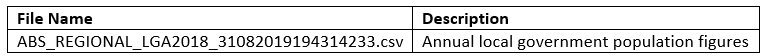

## Background
Towards zero is the 2016-2020 road safety strategy for the state of Victoria. The strategy is a collaboration between multiple Victorian government bodies including the Transport Accident Commission, VicRoads, Victorian Police, the Department of Justice and Regulation and the Department of Health and Human Services to achieve zero road deaths in Victoria.

The short term objective of the collaboration is to reduce annual road fatalities to below 200 by 2020 and reduce serious injuries, which require hospital admission, by 15% over the 5 year period between 2016-2020.

The Towards Zero campaign in centered upon the mantra of safer roads, safer speeds, safer vehicles and safer road users through improving infrastructure, focused education campaigns, increased monitoring and implementing innovations.


Since the implementation of the Towards Zero strategy, progress has been made to reduce both road fatalities and serious injuries. However, to ensure total deaths are below 200 by 2020, resourcing and policy needs to be implemented efficiently, which this investigation aims to inform.

### Weather Conditions as a Factor of Road Safety
Weather conditions are widely regarded as a leading contributing factor to road accidents
and implementing road laws such as variable speed limits to infludnce driver behavious.


## Proposed Research Questions
To further investigate the effect of external factors on Victorian road accidents, the following research questions are being proposed:   
1. How, and to what extent, do different weather conditions affect road accidents?   
2. Given our findings in question 1, what is the probability of a road accident occuring during wet weather, given the age of the driver?   
3. What changes, if any, do our findings recommend to the Towards Zero campaign?   

## Data Sets
Of the plethora of data sets investigated, a select few remain which satisfied the criteria of  a credible source, sufficient number of records, granularity at an individual level and relevant variables to address the proposed questions. The data sets identified are:

**Road Accident Data**


Provided by VicRoads, the state road and traffic authority, the road accident data set details 65 variables for over 180 thousand accidents occurring between 2006 and 2019 in Victoria, Australia.

**Weather Data Set**


The weather data set is sourced from the Bureau of Meteorology, providing comprehensive daily statistics pertaining to weather conditions across stations in Victoria.

**Population Data Set**



Provided by the ABS, the population data set will provide a contextual layer to the findings.

### Data Merging
To address the research questions proposed, the data sets need to be merged on dimensions of time and location. Daily crash and weather data allo

The research questions require us to determine the weather conditions at the location of the accident by taking data from the closest weather station, gence a merge between the weather station and road accident data sets.

To determine which weather station is most appropriate for the site of a road accident, the distance between the two is to be quantified.  of results. Then we will take only those readings contain minimum value of distance calculated.

## Regression Modelling
_Regression modelling techniques to be employed_


## Issues
Throughout the project, the following have been identified as potential issues to consider and address:
* Accurately assigning weather conditions to each road accident
* Multicollinearity between weather conditions
* Accounting for potentially missing explanatory variables
* complexity of capturing and measuring weather variables

## Appendix
#### Reading Libraries
``` {r, results='hide', message=FALSE, warning=FALSE}
library(tidyverse)
library(geosphere) #to calculate geographical distances
```

#### Reading Data
``` {r, results='hide', message=FALSE, warning=FALSE}
accident <- read.csv("Datasets/Road Crashes/ACCIDENT.csv")
climate86018 <- read.csv("Datasets/Climate/86018.csv")
accident_node <-  read.csv("Datasets/Road Crashes/NODE.CSV")
```

#### Data Transformation
```{r}
glimpse(accident)
glimpse(climate86018)

#Adding station latitude and longitude to all rows (to calculate distance between the accident and climate station)
climate86018$station_lat <- rep(-37.8795,nrow(climate86018))
climate86018$station_long <- rep(145.0368,nrow(climate86018))

#Converting fct to date
accident$ACCIDENTDATE <- as.Date(accident$ACCIDENTDATE, "%d/%m/%Y")
climate86018$YYYY.MM.DD  <- as.Date (climate86018$YYYY.MM.DD, "%Y-%m-%d")

#Rename date columns (to be used as primary key between accidents and climate data)
accident <- accident %>% rename (DATE = ACCIDENTDATE)
climate86018 <- climate86018 %>% rename (DATE = YYYY.MM.DD)
```

#### Merging Data
```{r}
#Creating mergedFiles object, which contains accident, accident location and climate data
mergedFiles <- merge(accident,accident_node,by="ACCIDENT_NO")
mergedFiles <- merge(mergedFiles, climate86018,by="DATE")
```

#### Calculating Distance
```{r}
#Adding dist_station_crash column with distance between accident location and climate observatory
mergedFiles <- mergedFiles %>% 
	mutate(dist_station_crash = distHaversine(cbind(station_long, station_lat), cbind(Long, Lat)))

glimpse(mergedFiles)
```

## References
https://www.sciencedirect.com/science/article/pii/S0001457513000948

https://www.sciencedirect.com/science/article/pii/S0966692398000477	

https://ops.fhwa.dot.gov/weather/q1_roadimpact.htm
